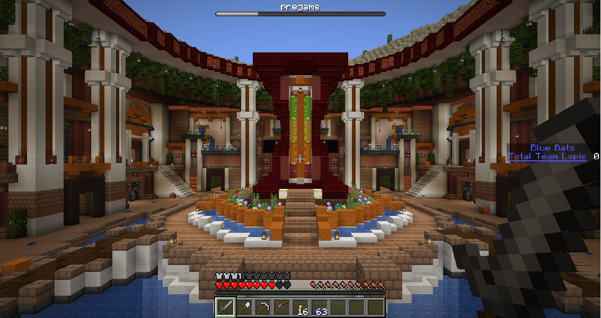
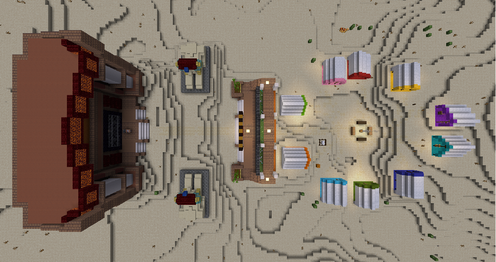
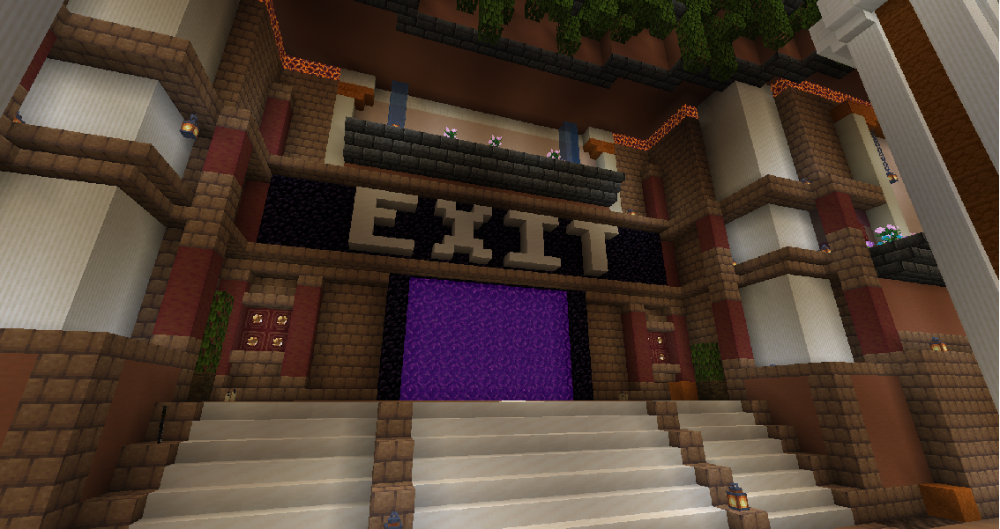
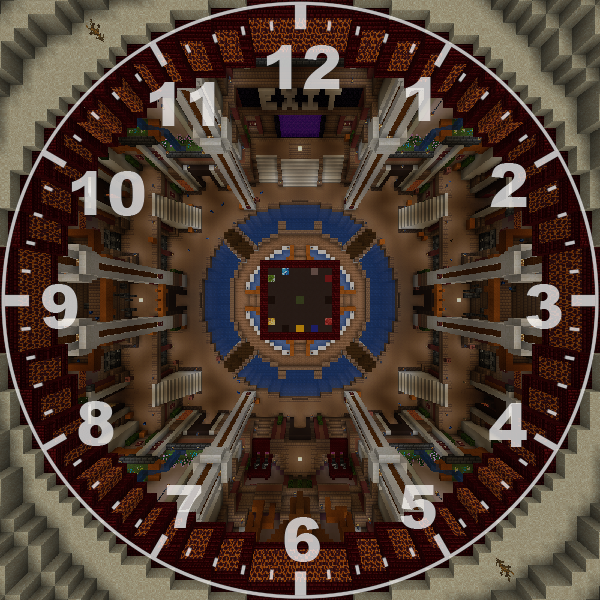
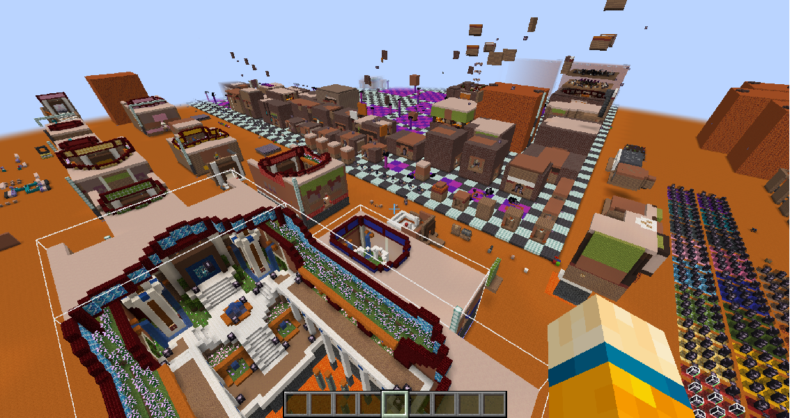

# Red Sands of Time

This is a Minecraft data pack inspired by MC Championship's [Sands of Time](https://mcchampionship.com/pages/sands-of-time/) minigame.  
*Disclaimer: I am not affiliated with Noxcrew.  
I just wanted my own version of the game for my own enjoyment.*  




## Table of Contents

- [Red Sands of Time](#red-sands-of-time)
  - [Table of Contents](#table-of-contents)
  - [Installation](#installation)
    - [Configure server.properties](#configure-serverproperties)
    - [One Time Setup](#one-time-setup)
  - [How to Operate](#how-to-operate)
  - [How to Play](#how-to-play)
  - [Bug Reporting](#bug-reporting)
  - [How to Customize](#how-to-customize)
    - [Prerequisite Knowledge](#prerequisite-knowledge)
    - [Creating a new Room Structure](#creating-a-new-room-structure)
      - [Naming Guidelines](#naming-guidelines)
      - [Block Palette](#block-palette)
      - [Structure Void](#structure-void)
      - [Decoration Jigsaw Blocks](#decoration-jigsaw-blocks)
      - [Door frame Jigsaw Blocks](#door-frame-jigsaw-blocks)
      - [Deadend Structures](#deadend-structures)
    - [Implementing With the Data Pack](#implementing-with-the-data-pack)
    - [Creating a new Blueprint Structure](#creating-a-new-blueprint-structure)
  - [Planned Features](#planned-features)


## Installation

This datapack isolates all generated structures to its own custom dimensions.  
It will not generate over any existing user-created worlds.  
Install RSOT the same way you'd install any other datapack.  
See [Tutorials/Installing a data pack](https://minecraft.wiki/w/Tutorials/Installing_a_data_pack) from the Minecraft wiki.  


### Configure server.properties

Set the following variables in your ```server.properties``` file:  
```
enable-command-block=true
```
```
initial-enabled-packs=vanilla, file/Red Sands of Time
```
```
resource-pack=https\://github.com/CrownedComedian/Red-Sands-of-Time-Resource-Pack/releases/latest/download/Red.Sands.of.Time.Resource.Pack.zip
```  
Once installed, you'll have to do some one-time setup (see below) after starting and joining your server.  


### One Time Setup

Now with the data pack installed and your server running, join your server and execute the following commands:  
```/execute in rsot:liminal_space run tp @s ~ ~ ~```  
```/locate structure rsot:liminal_space```  
Click on the coordinates to copy the command to teleport you to the location where this structure generated and execute the teleport command.  
If no structure was found, run:  
```/place structure rsot:liminal_space```  
This structure consists of 10 tents, a scoreboard structure, and a cage structure.  
Make sure all sub structures listed have been generated (see image below).  
Finally, press the big install button in front of the scoreboard structure!  
I recommend copying some coordinates near the campfire with ```F3```+```C``` for new players to join.  




## How to Operate

There are three main commands needed to operate the game:  

```/function rsot:admin/open```  
Allows players in ```rsot:liminal_space``` to change their team before the next game.  
Not needed if all players would like to stick with their team.  

```/function rsot:admin/start```  
Starts the pre-game timer and begins the game!  

```/function rsot:admin/end```  
Reveals teams' banked scores.  
Execute this command when all players have returned to ```rsot:liminal_space```.  

The game does not automatically end (for now).  
Some gamerules are set when the data pack is loaded in.  
These can be found in ```data > rsot > function > gamerules.mcfunction```  
Video tutorial coming soon!


## How to Play

Red Sands of Time is game that requires communication, time-management, PvE skills, and quick thinking.  
*Before the game begins, players can join a team by walking into one of the ten colored team tents of the campsite in ```rsot:liminal_space```.*  
In a classic game, there are ten teams, each consisting of four players; however, *the game can run with fewer than ten teams and any number of players per team.*  
Each team spawns in their own tomb, isolated from opponent teams.  
There will be a 60 second pre-game grace period for team members to discuss their strategy.   

After the countdown, players traverse through the eleven paths in search for red sand, lapis lazuli, and other resources in decorated pots.  
The gamemode is set to adventure, so players must use anything but their fist to break decorated pots and collect red sand.  

*Lapis lazuli can be found sprinkled on the ground, as loot mined by monster spawners, a reward for igniting candles, and locked behind treasure vaults.*  
Treasure vaults can be unlocked with color-matching keys found separately in the paths of the tomb.  

*A team's score is the collective total of all lapis lazuli banked by players of that team.*  
To bank lapis lazuli, players must escape the tomb before their timer runs out through the exit portal located in the hub of the tomb across the spawn platform.  
*This is the only way out of the tomb and the only way to bank your score!*  
Once a player exits the tomb they cannot return.  

In the center of the tomb hub is the game timer.  
The timer runs on red sand.  
Teams need to gather red sand and bring it to the timer to keep the timer from running out.  
*To add red sand to the timer, place it on one of the composter blocks at the base of the timer.*  
The more red sand a team has, the longer they can explore the paths of the tomb to add lapis lazuli to their score.  

The timer will chime every 10 seconds as long as there is an adequate amount of red sand in the timer.  
If there is less than 10 seconds left on the timer, a chime will sound every 1 second.  
Be sure to exit the tomb before time runs out.  

If a player dies mid-game, they drop all collected loot, including 80% of their lapis lazuli.  
*The remaining 20% is lost forever.*  
Players will respawn in a cell near the spawn point of the hub.  
A teammate is required to sacrifice one red sand block to free the player.  

During the game, information about opposing teams is very limited.  
Scores are revealed only once all teams have expired their sand timers or escaped their tomb via the exit.  
There are many secrets to be found in the tombs.  
Do your best, have fun, and don't get sealed in!




## Bug Reporting

In the unlikely event of a buggy tomb generation, submit an issue here on GitHub.  
Please include the following:
- Full world seed (can be obtained with ```/seed```)  
- Exact x & z coordinates of the tomb center (should be the corner of a chunk.  Or use ```/data get storage rsot:generation location```)  
- Which destinations are selected including their depth scores (can be obtained with ```/function rsot:tellraw/depths```)  
- Which path is broken (exit portal is twelve o'clock and the path below spawn is six o'clock)  




## How to Customize

You can add your own custom rooms to the pool for generation in your games in two complicated steps:  
 - creating the .nbt structure file(s)
 - implementing the structure(s) into the data pack

Please read this entire section before attempting to begin!

### Prerequisite Knowledge

You should know the basic mechanics of jigsaw blocks, .nbt structure files, and template pools.  
Paths branching out of the hub use jigsaw blocks to generate properly.  
Path structures generate blueprint structures.  
Blueprint structures generate either room structures or smaller blueprint structures.  
Room structures are filled with tiny decoration structures.  


### Creating a new Room Structure

When designing a new room, ther are some vertical and horizontal rules you must follow.  

Horizontal Restrictions:  
 - The width and depth of all rooms must be a multiple of 5.  
   This means that all rooms can be divided up into squares of 5x5 blocks.  
 - The max room size is 9x9 squares (45x45 blocks) though I don't recommend it.  
 - Doorframes leading out of a room must be centered on these squares in order to connect properly.  

Verticle Restrictions:  
 - You can build down to 6 blocks below ground level and 13 blocks above ground level.  
 - A room can be up to three floors tall.  
 - Each floor has 4 blocks in-between ground levels.  
   This means that the max height a room can be is 30 blocks tall (6+1+4+1+4+1+13) as long as all door frames are on the appropreate height(s).


#### Naming Guidelines

All room structures are named to be saved and organized by size first, then doorframe position(s), and lastly unique feature.  
It is strongly recommended you follow these guidelines in your structure block:  

Structure Name: ```rsot:rooms/<horizontal_square_dimensions>/<doorframe_positions>_<unique_feature>```
 - horizontal_square_dimensions: always in the form of ```#x#``` with the smaller number first.  eg. ```3x4``` would represent a room 12x16 blocks thicc.  
 - doorframe_positions: list of ```<edge><possible_floors>``` separated by ```_``` underscores.  Listed in order of smallest edge number to largest edge number.
   - edge: square edge number of structure, starting from one of the structure corners and increasing clockwise from a bird's eye view.  Typically, the starting edge is after the red line of the structure bounding box because I built all these structures in one world arrayed all next to each other.  
   - possible_floors: combination of ```b``` ```m``` ```t```.
     - ```b```: represents a doorframe that could generate on the bottom floor.   
     - ```m```: represents a doorframe that could generate on the middle floor.  
     - ```t```: represents a doorframe that could generate on the top floor.  

Examples:

```rsot:rooms/2x5/4bmt_11bmt_empty_flower_pots```: Let's break it down!  
 - ```2x5```: this tells me that the room is 10x25 blocks wide.  
 - ```4bmt_11bmt```: this tells me that there are two doorframes leading out of this room, one on edge 4 and the other on edge 11.  Edges 4 and 11 are symmetric opposites of each other because of the 2x5 perimeter.  Since both doorframes share the same ```bmt``` suffix, they are both on the same level.  Each doorframe can be placed on either the bottom, middle, or top floors, meaning the structure's height never exceeds the 13 block limit above both doorframe's ground level nor does the structure decend more than 6 blocks below the ground level.  This structure is only one floor tall, and at max 20 blocks tall.  
 - ```empty_flower_pots``` the prominent feature that I think of when I see this room.  Just something I can remeber it by.  

```rsot:rooms/3x3/2t_5m_8b_spire```: This one is a classic!
 - ```3x3```: this is 15x15 blocks wide.  
 - ```2t_5m_8b```: there are three doorframes leading out of this room. Because this is a 3x3 perimeter and we start counting edges from a corner of the structure, we can deduce that each doorframe is in the center of a side of the structure.  Three of the structure sides have doorframes, while one side does not.  Each doorframe is on a different level because each hold a unique suffix.  The doorframe on edge 2 can only be placed on the top floor.  The doorframe on edge 5 can only be placed on the middle floor.  The doorframe on edge 8 can only be placed on the bottom floor.  
 - ```spire``` the spiral staircase where players have to jump from one level to the next.  Seen all the time in SoT.  


#### Block Palette

Because players are in adventure mode, we must specify which blocks we allow them to place torches/carpet on.  
This list can be found in ```data/rsot/tags/block/carpet_placeable.json```.  
Torches use the ```placeable``` list which includes the ```carpet_placable``` list and Minecraft's ```wool_carpets``` list.  
This is done so players cannot place more carpet on top of carpet, while allowing torches to be placed even when targeting the side of a carpet block.  
Add any blocks you plan to use and want players to be able to place torches/carpet on to the ```carpet_placeable``` list.  

#### Structure Void

All structure void blocks will be replaced with the path decoration block.  

#### Decoration Jigsaw Blocks

I use jigsaw blocks to add decoration such as lapis, spawners, decorated pots, red sand, and candles.  
Place a jigsaw block 1 block above ground level, pointing up.  
Make sure the block above this jigsaw block is air.  
Fill in these fields as follows:  

Target Pool: ```rsot:decorations/<template_pool>```  
 - template_pool: should be ```potential_lapis_pile```, ```lapis_pile```, ```potential_interest```, ```interest```, ```potential_spawner```, ```spawner```, ```potential_candles```, ```candles```, or ```large_lapis_pile```.  

Name: ```minecraft:empty``` (defualt)  

Target Name: ```rsot:decoration```  

Turns into: ```minecraft:air``` (default)  

#### Door frame Jigsaw Blocks

Follow these jigsaw block configurations in order to connect rooms properly:  

Target Pool: ```minecraft:empty``` (default)  

Name: ```rsot:piece.<floor>.<square_depth>d.<square_length><side>```  
 - floor: one of ```b```, ```m```, or ```t```.  
   - ```b```: represents a doorframe that could generate on the bottom floor.  This requires the jigsaw block to be 1 block above ground level. 
   - ```m```: represents a doorframe that could generate on the middle floor.  This requires the jigsaw block to be 2 blocks above ground level. 
   - ```t```: represents a doorframe that could generate on the top floor.  This requires the jigsaw block to be 3 blocks above ground level.  
 - square_depth: how many squares deep does this room structure expand from this doorframe.  
 - square_length: how many squares in from the side edge of the room structure to this doorframe.  
 - side: either ```l```, or ```r```.  
   - ```l``` representing left.  This requires the jigsaw block to be 1 block left of the center of the doorframe's square.   
   - ```r``` representing right.  This requires the jigsaw block to be 1 block right of the center of the doorframe's square.   

Target Name: ```minecraft:empty``` (default)  

Turns into: ```minecraft:air``` (default)  

#### Deadend Structures

TODO - more on this to come at a later date


### Implementing With the Data Pack

TODO - more on this to come at a later date


### Creating a new Blueprint Structure

TODO - more on this to come at a later date


## Planned Features

Listed in no particular order:  
- Pink vault & key destination rooms
- Cyan vault & key destination rooms
- Gray vault & key destination rooms
- Purple vault & key destination rooms
- Red key crossword puzzle room
- Liminal space game control panel
  - set selected destinations
  - set destination depths
  - easy/hard difficulty levels
- Subtle pathway identifiers
- More puzzle rooms
- More blueprints
- Branching path generation
- Pause/unpause feature
- Automatically end the game

