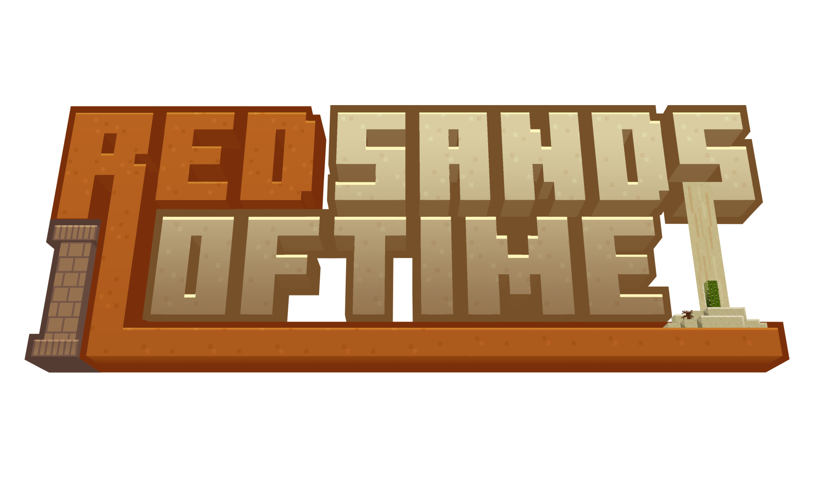

*logo by DexFlex_YT*

This is a Minecraft data pack inspired by MC Championship's [Sands of Time](https://mcchampionship.com/pages/sands-of-time/) minigame.  
*Disclaimer: I am not affiliated with Noxcrew.  
I just wanted my own version of the game for my own enjoyment.*  


## Table of Contents

- [Table of Contents](#table-of-contents)
- [Installation](#installation)
  - [Configure server.properties](#configure-serverproperties)
  - [One Time Setup](#one-time-setup)
- [How to Operate](#how-to-operate)
- [How to Play](#how-to-play)
- [Bug Reporting](#bug-reporting)
- [Planned Features](#planned-features)


## Installation

This datapack isolates all generated structures to its own custom dimensions.  
It will not generate over any existing user-created worlds.  
Install RSOT the same way you'd install any other datapack.  
See [Tutorials/Installing a data pack](https://minecraft.wiki/w/Tutorials/Installing_a_data_pack) from the Minecraft wiki.  


### Configure server.properties

Set the following variables in your ```server.properties``` file:  
```
enable-command-block=true
```
```
initial-enabled-packs=vanilla, file/Red Sands of Time
```
```
resource-pack=https\://github.com/CrownedComedian/Red-Sands-of-Time-Resource-Pack/releases/download/v1.2.1/Red.Sands.of.Time.Resource.Pack.zip
```  
Once installed, you'll have to do some one-time setup (see below) after starting and joining your server.  


### One Time Setup

Now with the data pack installed and your server running, join your server and execute the following commands:  
```/execute in rsot:liminal_space run tp @s ~ ~ ~```  
```/locate structure rsot:liminal_space```  
Click on the coordinates to copy the command to teleport you to the location where this structure generated and execute the teleport command.  
If no structure was found, run:  
```/place structure rsot:liminal_space```  
This structure consists of 10 tents, a scoreboard structure, and a cage structure.  
Make sure all sub structures listed have been generated (see image below).  
Finally, press the big install button in front of the scoreboard structure!  
I recommend copying some coordinates near the campfire with ```F3```+```C``` for new players to join.  


## How to Operate

There are three main commands needed to operate the game:  

```/function rsot:admin/open```  
Allows players in ```rsot:liminal_space``` to change their team before the next game.  
Not needed if all players would like to stick with their team.  

```/function rsot:admin/start```  
Starts the pre-game timer and begins the game!  

```/function rsot:admin/end```  
Reveals teams' banked scores.  
Execute this command when all players have returned to ```rsot:liminal_space```.  

The game does not automatically end (for now).  
Some gamerules are set when the data pack is loaded in.  
These can be found in ```data > rsot > function > gamerules.mcfunction```  
Video tutorial coming soon!


## How to Play

Red Sands of Time is game that requires communication, time-management, PvE skills, and quick thinking.  
*Before the game begins, players can join a team by walking into one of the ten colored team tents of the campsite in ```rsot:liminal_space```.*  
In a classic game, there are ten teams, each consisting of four players; however, *the game can run with fewer than ten teams and any number of players per team.*  
Each team spawns in their own tomb, isolated from opponent teams.  
There will be a 60 second pre-game grace period for team members to discuss their strategy.   

After the countdown, players traverse through the eleven paths in search for red sand, lapis lazuli, and other resources in decorated pots.  
The gamemode is set to adventure, so players must use anything but their fist to break decorated pots and collect red sand.  

*Lapis lazuli can be found sprinkled on the ground, as loot mined by monster spawners, a reward for igniting candles, and locked behind treasure vaults.*  
Treasure vaults can be unlocked with color-matching keys found separately in the paths of the tomb.  

*A team's score is the collective total of all lapis lazuli banked by players of that team.*  
To bank lapis lazuli, players must escape the tomb before their timer runs out through the exit portal located in the hub of the tomb across the spawn platform.  
*This is the only way out of the tomb and the only way to bank your score!*  
Once a player exits the tomb they cannot return.  

In the center of the tomb hub is the game timer.  
The timer runs on red sand.  
Teams need to gather red sand and bring it to the timer to keep the timer from running out.  
*To add red sand to the timer, place it on one of the composter blocks at the base of the timer.*  
The more red sand a team has, the longer they can explore the paths of the tomb to add lapis lazuli to their score.  

The timer will chime every 10 seconds as long as there is an adequate amount of red sand in the timer.  
If there is less than 10 seconds left on the timer, a chime will sound every 1 second.  
Be sure to exit the tomb before time runs out.  

If a player dies mid-game, they drop all collected loot, including 80% of their lapis lazuli.  
*The remaining 20% is lost forever.*  
Players will respawn in a cell near the spawn point of the hub.  
A teammate is required to sacrifice one red sand block to free the player.  

During the game, information about opposing teams is very limited.  
Scores are revealed only once all teams have expired their sand timers or escaped their tomb via the exit.  
There are many secrets to be found in the tombs.  
Do your best, have fun, and don't get sealed in!


## Bug Reporting

In the unlikely event of a buggy tomb generation, submit an issue here on GitHub.  
Please include the following:
- Full world seed (can be obtained with ```/seed```)  
- Exact x & z coordinates of the tomb center (should be the corner of a chunk.  Or use ```/data get storage rsot:generation location```)  
- Which destinations are selected including their depth scores (can be obtained with ```/function rsot:tellraw/depths```)  
- Which path is broken (exit portal is twelve o'clock and the path below spawn is six o'clock)  


## Planned Features

Listed in no particular order:  
- Pink vault & key destination rooms
- Cyan vault & key destination rooms
- Gray vault & key destination rooms
- Purple vault & key destination rooms
- Red key crossword puzzle room
- Liminal space game control panel
  - set selected destinations
  - set destination depths
  - easy/hard difficulty levels
- More puzzle rooms
- More blueprints
- Branching path generation
- Pause/unpause feature
- Automatically end the game

